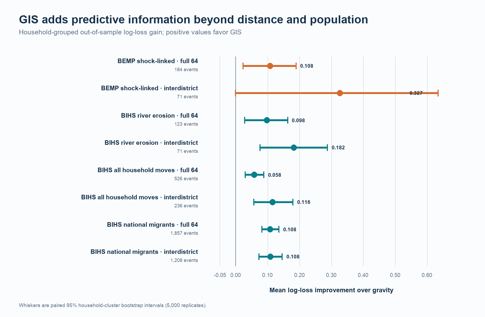
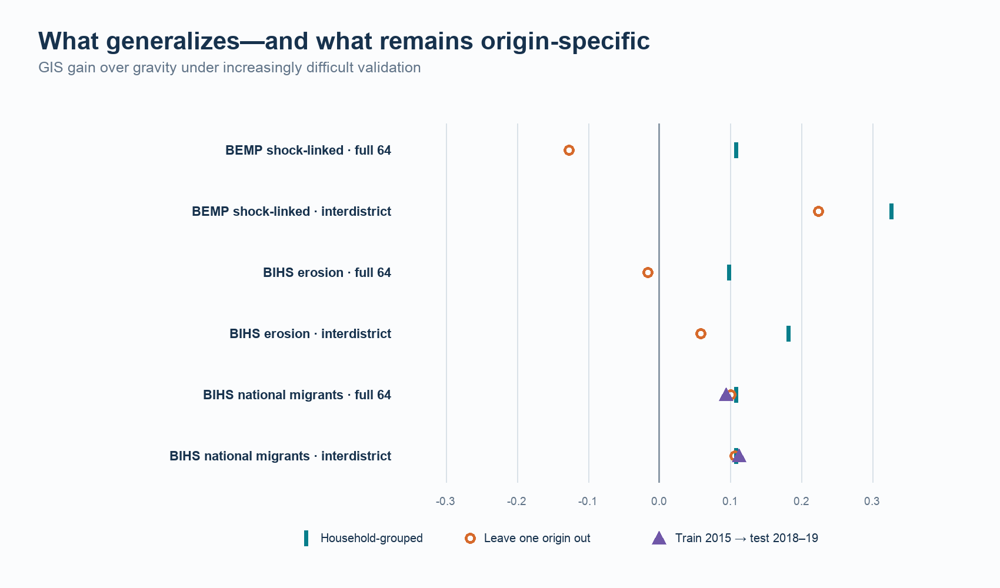
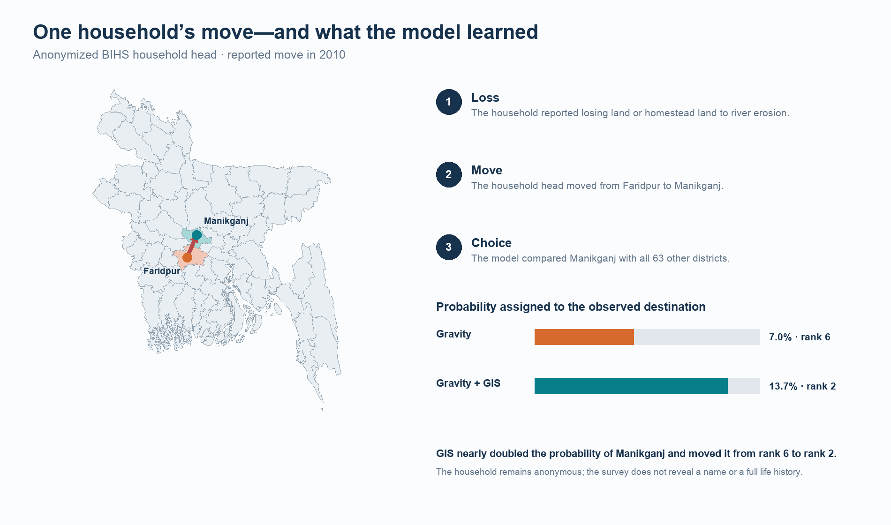

# Where Do Climate-Affected Households Go?

## Revealed District Choice in Bangladesh

**Shail Belani**  
Northwestern University  
Undergraduate Researcher, Global Poverty Research Lab  
shailbelani2027@u.northwestern.edu

**Draft date:** August 30, 2026

## Abstract

Research on climate mobility often asks whether environmental shocks make people move. This paper asks where people go after a move occurs. I construct revealed district-choice events from two independent Bangladesh surveys: the Bangladesh Environmental Mobility Panel (BEMP), which followed households exposed to riverbank erosion and flooding along the Jamuna River, and the nationally representative rural Bangladesh Integrated Household Survey (BIHS). Each observed move is compared with the same 64 candidate districts. A fitted gravity model uses destination population and origin-destination distance. A pre-specified GIS model adds four district attributes: historical flood exposure, built surface, travel time to cities, and cropland. Household-grouped out-of-sample tests show that GIS improves the probability assigned to observed destinations. The mean log-loss gain is 0.108 for 184 shock-linked BEMP relocations and 0.098 for 123 BIHS relocations attributed to river-erosion land loss. In a broader BIHS sample of 1,857 current migrants, the gain is 0.108 and persists when each origin district is omitted from training. The smaller climate samples expose a boundary. GIS does not improve the full stay-versus-leave problem when an entire origin is unseen, although its interdistrict advantage remains positive. District characteristics therefore carry transferable information about destination ranking, while the decision to remain within an origin district depends more heavily on local conditions. The analysis is predictive and associational; it does not identify causal effects of destination attributes.

## 1. Introduction

In 2010, an anonymized household head in the BIHS reported leaving Faridpur for Manikganj after river erosion caused the loss of land or homestead land. The move appears in a survey row, stripped of a name and most of the household's story. It still poses a concrete question. Why Manikganj rather than one of Bangladesh's other districts?

Most climate-mobility research begins at the origin. It estimates whether floods, erosion, drought, or crop loss change migration rates. That work has corrected the simple idea that environmental damage always produces long-distance displacement. In rural Bangladesh, disasters can increase local movement, reduce movement by destroying the resources needed to leave, or have little measurable effect on mobility (Gray and Mueller 2012). Environmental pressures also combine with economic, social, demographic, and political conditions rather than operating alone (Black et al. 2011).

The destination receives less attention. Findlay (2011) argued that climate-mobility research should study where observed movers go instead of concentrating only on projected counts. That shift matters for planning. A household's origin identifies exposure and loss. Its destination determines the labor market, housing conditions, agricultural base, infrastructure, social ties, and future hazards the household encounters.

This paper treats an observed move as a choice among candidate districts. It asks whether a small set of mapped destination attributes predicts that choice better than two familiar spatial baselines. The gravity model rewards large, nearby destinations. The radiation model also accounts for population between origin and destination (Simini et al. 2012). The GIS model retains distance and population, then adds flood history, settlement intensity, urban accessibility, and cropland.

The design has three advantages. First, BEMP supplies longitudinal shock histories and household relocations from erosion-prone communities. Second, BIHS provides an independent river-erosion relocation question and national origin coverage. Third, every model faces household-grouped, temporal, and origin-held-out tests. The analysis therefore separates ordinary out-of-sample prediction from the harder problem of transferring a learned destination utility to a place absent from training.

The result is consistent across surveys. GIS improves ordinary out-of-sample destination probabilities in the BEMP shock-linked sample, the BIHS river-erosion sample, all BIHS household relocations, and the larger BIHS migrant sample. The national migrant result also transfers across unseen origins and into a later survey wave. The climate samples are less portable in the full 64-district task because that task mixes two decisions: whether to stay inside the origin district and where to go after crossing its boundary. When the analysis conditions on a cross-district move, the GIS advantage remains positive in both climate datasets, although small samples leave wide intervals.

The contribution is deliberately narrow. Four district characteristics add repeatable predictive information beyond distance and population. Individual coefficients do not describe causal preferences. Districts also hide movement within villages and neighborhoods. Those limits define what the public survey geography can support.

## 2. Destination choice after environmental loss

Environmental shocks can alter mobility through several channels. Erosion destroys land and housing. Flooding damages crops, assets, transport, and local employment. A household may move to protect income, remain close to land and relatives, or lack the money needed for a distant move. Freihardt (2025) finds that erosion can raise migration aspirations while reducing the capability to move among Jamuna River households. Related BEMP work documents frequent short-distance relocations and the role of land access and social ties (Freihardt 2026).

These mechanisms imply that staying and destination selection need not follow the same process. A household can rebuild nearby, shift within its district, or cross a district boundary. The local availability of land, kin support, credit, roads, and temporary shelter may govern the first split. Once a household crosses the boundary, candidate destinations differ in accessibility, settlement, agriculture, flood history, and the opportunities those features approximate.

The four GIS variables do not measure every part of that decision. Built surface is not a wage. Cropland is not a job offer. Travel time is not a household's actual trip. Flood exposure is not perceived safety. Together, however, the variables provide a common description of all 64 districts. They let the model score destinations that received few or no moves in the estimation sample without learning a separate fixed effect for each district.

The empirical hypothesis is predictive: adding the four GIS characteristics should lower held-out log loss relative to gravity. The harder transport hypothesis asks whether the same improvement survives when the model has never observed a mover from the test origin. The two questions require separate answers.

## 3. Data

### 3.1 Bangladesh Environmental Mobility Panel

BEMP followed 1,691 households and 2,170 panel respondents from 2021 through 2024 in communities selected along the eastern bank of the Jamuna River. The public release contains four annual in-person rounds and ten shorter phone rounds (Freihardt, Rudolph, and Koubi 2026). Migrants were followed across survey waves.

The event ledger uses new household-destination observations and reconstructs the latest valid pre-move district. A shock-linked event requires a recorded home flood or riverbank-erosion shock before the move interval. Public data identify origin and destination districts, not exact household coordinates. The primary BEMP sample contains 184 whole- or partial-household relocations from 137 households. Seventy-one cross a district boundary; 113 remain within the origin district.

BEMP offers the strongest temporal connection between environmental exposure and a later move. Its geographic support is narrow. The climate sample comes from seven observed origin districts and concentrates heavily in a small set of destinations. National candidate coverage cannot turn those origins into a national sample.

### 3.2 Bangladesh Integrated Household Survey

BIHS is a nationally representative rural household panel administered in 2011-12, 2015, and 2018-19 by the International Food Policy Research Institute. It samples all administrative divisions and contains detailed modules on households, agriculture, shocks, migration, and remittances (IFPRI 2011, 2016, 2020).

I construct two BIHS designs. The 2015 household-relocation module records the previous district, current district, year, and reason for the household head's last change of residence. The main climate replication contains 123 moves explicitly attributed to losing land or homestead land through river erosion. These events cover 29 origin districts, and 71 cross a district boundary. A broader comparison uses all 526 district-resolved household relocations in the module.

The second design uses current migrants reported in the 2015 and 2018-19 migration modules. The conservative event ledger keeps 1,857 interval-specific domestic migrants from 1,404 households. Each person was away for at least six months and outside the origin upazila. The sample covers all 64 origin districts and 63 observed destination districts; 1,208 events cross a district boundary. It records a stock of current individual migrants, not complete migration spells or whole-household displacement.

BIHS supplies broader geographic coverage and an independent erosion measure. Its environmental timing is weaker than BEMP's. Some household relocations are retrospective, and the current-migrant sample should not be described as a climate-migration sample.

### 3.3 Choice sets and administrative geography

Every event receives the same national district universe. The full task includes all 64 districts, including the origin district. It jointly evaluates staying within the origin district and moving elsewhere. The interdistrict task excludes the origin and evaluates only observed cross-district moves against 63 candidates.

District names from BEMP, BIHS, and GIS sources are reconciled to a frozen Bangladesh Bureau of Statistics crosswalk. Population comes from the 2022 Population and Housing Census (Bangladesh Bureau of Statistics 2023). District polygons follow the public BBS administrative boundary release. The same crosswalk and candidate ordering are used throughout.

**Table 1. Analysis samples**

| Dataset and sample | Unit | Events | Cross-district events | Observed origins | Timing strength |
|---|---|---:|---:|---:|---|
| BEMP shock-linked relocations | Whole/partial household move | 184 | 71 | 7 | Lagged recorded flood or erosion before move interval |
| BIHS erosion relocations | Household-head residential move | 123 | 71 | 29 | Retrospective reason: erosion-related land loss |
| BIHS all household relocations | Household-head residential move | 526 | 236 | 61 | Retrospective move history |
| BIHS interval migrants | Current individual migrant | 1,857 | 1,208 | 64 | Interval-specific current migrant stock |

## 4. Destination measures

The gravity benchmark contains log destination population and log effective distance. Great-circle distance between district centers is adjusted for district size. This gives the within-district alternative a finite positive distance rather than zero.

The GIS model adds four destination measures selected before the BIHS outcomes were examined:

1. **Historical flood exposure:** the share of valid district land flooded in at least one selected Global Flood Database event from 2000 through 2018. The source uses 250-meter MODIS observations of 913 large floods (Tellman et al. 2021).
2. **Built surface:** built square meters divided by valid district land area from the 2020 epoch of GHS-BUILT-S R2023A (Schiavina et al. 2023).
3. **Urban accessibility:** the area-weighted median travel time to the nearest city of at least 50,000 people using the 2015 global accessibility surface (Weiss et al. 2018).
4. **Cropland:** the share of valid district land classified as cropland in ESA WorldCover 2020 at 10-meter resolution (Zanaga et al. 2021).

All four variables cover every district. Raster extraction uses land masks, boundary-cell fractions, and area-aware calculations. Each training fold supplies its own means and standard deviations for GIS standardization. The test fold never contributes to scaling.

The timing contract warrants care. The GIS layers provide a common district description, not event-year causal exposures. BEMP move intervals reach 2021-24, BIHS migration records extend further back, and 2022 population postdates some moves. The variables therefore enter a prediction model. They should not be read as treatments occurring before every household decision.

## 5. Empirical design

For mover or household event i, origin o, and candidate destination j, the gravity utility is

\[
Uᴳᵢₒⱼ = β₁ log(Popⱼ) + β₂ log(Distanceₒⱼ).
\]

The GIS utility is

\[
Uᴳᴵˢᵢₒⱼ = Uᴳᵢₒⱼ + γ′Zⱼ,
\]

where Zⱼ contains the four standardized GIS attributes. Candidate probabilities follow the conditional-logit softmax over the relevant choice set. The primary GIS estimator applies a ridge penalty to the four GIS coefficients while leaving the gravity coefficients unpenalized. An inner household-grouped validation loop selects the penalty from 0.001, 0.01, 0.1, 1, 10, and 100. A low-dimensional unpenalized fit remains a diagnostic.

The fitted gravity model is the primary comparator. A uniform model and an adapted radiation model provide secondary checks. No destination fixed effects, observed destination frequencies, move reasons, or post-move network reports enter candidate utility.

### 5.1 Evaluation

The main validation uses five household-grouped folds. All events from the same household remain together, and every transformation is estimated inside the training data. The primary metric is event log loss, the negative log probability assigned to the chosen district. I report GIS gain as gravity log loss minus GIS log loss. A positive value favors GIS. Rank and top-choice accuracy serve as secondary measures.

Paired uncertainty comes from 5,000 household-cluster bootstrap samples of held-out event losses. Because the two models predict the same events, the bootstrap resamples their within-event loss difference rather than treating model results as independent.

Two tests raise the difficulty. The temporal test estimates the national BIHS migrant model on 2015 events and evaluates it on 2018-19 events. Leave-one-origin-out validation trains without any event from the test origin district. The latter asks whether a destination utility learned elsewhere can score movers from a place absent from training.

The full task and interdistrict task answer different questions. Full-choice performance includes the probability of remaining inside the origin district. Interdistrict performance conditions on crossing the boundary and evaluates the ranking of the other 63 districts. The paper reports both rather than treating same-district movement as an ordinary zero-distance trip.

## 6. Results

### 6.1 Grouped out-of-sample prediction

GIS lowers held-out log loss in every pre-specified grouped comparison. Table 2 reports the direct model, which keeps the candidate utility identical across surveys.

**Table 2. GIS gain over fitted gravity in household-grouped validation**

| Dataset and sample | Choice set | Events | Gravity log loss | GIS log loss | GIS gain | Household-cluster 95% interval |
|---|---|---:|---:|---:|---:|---:|
| BEMP shock-linked relocations | Full 64 | 184 | 1.630 | 1.522 | 0.108 | [0.023, 0.189] |
| BEMP shock-linked relocations | Interdistrict 63 | 71 | 2.484 | 2.157 | 0.327 | [-0.001, 0.634] |
| BIHS erosion relocations | Full 64 | 123 | 2.563 | 2.465 | 0.098 | [0.028, 0.163] |
| BIHS erosion relocations | Interdistrict 63 | 71 | 3.256 | 3.074 | 0.182 | [0.076, 0.287] |
| BIHS all household relocations | Full 64 | 526 | 2.206 | 2.148 | 0.058 | [0.030, 0.088] |
| BIHS all household relocations | Interdistrict 63 | 236 | 3.253 | 3.138 | 0.116 | [0.056, 0.179] |
| BIHS interval migrants | Full 64 | 1,857 | 2.060 | 1.952 | 0.108 | [0.082, 0.135] |
| BIHS interval migrants | Interdistrict 63 | 1,208 | 2.021 | 1.913 | 0.108 | [0.073, 0.145] |

The two most comparable climate estimates are close: 0.108 in BEMP and 0.098 in the BIHS erosion sample. The broader national BIHS migrant sample also produces a 0.108 gain. These values were estimated in separate surveys with different migration definitions. Their similarity was not imposed.

The nested full-choice model treats staying and crossing as separate stages. Its GIS gains over direct gravity are 0.124 for BEMP shock-linked moves, 0.129 for BIHS erosion relocations, 0.116 for all BIHS household relocations, and 0.216 for the national migrant sample. These results support the distinction between the boundary-crossing decision and destination ranking.

The adapted radiation model performs worse than fitted gravity in the BIHS interdistrict samples. Population between origin and destination does not replace the four destination measures in this application.

### 6.2 Time and unseen origins

Training on BIHS 2015 migrants and testing on 2018-19 migrants preserves the gain. GIS improves full-choice log loss by 0.094 across 1,383 later-wave events and interdistrict log loss by 0.112 across 842 later-wave events.

The national model also transfers across origins. Leave-one-origin-out gains are 0.101 [0.074, 0.128] for the full choice set and 0.107 [0.073, 0.144] for interdistrict choice. Forty-six of 64 origins have a positive mean full-choice gain. Destination attributes learned elsewhere therefore retain predictive value for movers from districts omitted during estimation.

Climate-specific transport is weaker. The BIHS erosion sample produces a full-choice gain of -0.016 [-0.086, 0.045] and an interdistrict gain of 0.058 [-0.034, 0.140]. BEMP shows the same split in direction: -0.127 for full choice and +0.224 for interdistrict choice. BEMP has only seven climate-sample origins, so those origin-held-out estimates do not support a national claim.

**Table 3. Harder validation tests**

| Sample | Test | Choice set | Events | GIS gain | 95% interval |
|---|---|---|---:|---:|---:|
| BIHS interval migrants | Leave one origin out | Full 64 | 1,857 | 0.101 | [0.074, 0.128] |
| BIHS interval migrants | Leave one origin out | Interdistrict 63 | 1,208 | 0.107 | [0.073, 0.144] |
| BIHS erosion relocations | Leave one origin out | Full 64 | 123 | -0.016 | [-0.086, 0.045] |
| BIHS erosion relocations | Leave one origin out | Interdistrict 63 | 71 | 0.058 | [-0.034, 0.140] |
| BIHS interval migrants | Train 2015, test 2018-19 | Full 64 | 1,383 | 0.094 | Not bootstrapped |
| BIHS interval migrants | Train 2015, test 2018-19 | Interdistrict 63 | 842 | 0.112 | Not bootstrapped |

The evidence points to an origin boundary. A model trained elsewhere has difficulty assigning the probability of staying in an unseen erosion-affected district. Once a cross-district move is known, GIS destination ranking remains favorable in direction, although 71 erosion events cannot estimate that transfer precisely.

### 6.3 One household's observed move

The Faridpur household illustrates what changes when the model sees more than distance and population. Gravity assigned 7.0% probability to Manikganj and ranked it sixth among 64 districts. The GIS model assigned 13.7% and ranked it second. Faridpur remained the model's top candidate, so GIS did not recreate the household's decision perfectly. It made the chosen destination considerably more plausible.

The case does not disclose a name, family history, income, or private deliberation. It cannot show that flood exposure, built surface, accessibility, or cropland caused this household to choose Manikganj. It shows how an observed human journey becomes a transparent prediction test: the model scores every district, and the household's reported destination determines whether the probability assignment improved.

## 7. Discussion

The analysis answers the destination question with a qualified yes. Distance and population explain a substantial share of observed movement, especially the prevalence of nearby and same-district moves. Four mapped destination characteristics improve the remaining probability assignment across independent surveys.

The broad BIHS sample carries the strongest transfer result. Its origin coverage reaches all 64 districts, its improvement survives a later wave, and it remains positive when every test origin is excluded from training. This makes a narrow-origin artifact less plausible for general rural migration.

The climate result requires tighter wording. BEMP links recorded shocks to later moves, and BIHS directly records erosion-related land loss as a reason for relocation. Both samples show positive grouped performance. Neither small climate sample supports a general full-choice rule for an unseen origin. The model's difficulty centers on whether the chosen alternative remains the origin district. Local land markets, damage intensity, relief, kin support, and the feasibility of rebuilding nearby may dominate that split.

Social networks deserve a separate mechanism study. Among the 1,857 BIHS interval migrants, 1,815 reported help from friends or family at the destination. That field is measured after destination selection and only for the chosen place. Entering it into candidate utility would leak the outcome because equivalent network measures do not exist for all 63 unchosen districts. A future survey should ask pre-move households where relatives, friends, employers, and prior migrants live, then score the same network measure for every candidate destination.

For planners, the result shifts attention from counts alone to receiving places. Districts differ in settlement, agricultural land, access to cities, and accumulated flood exposure. A destination model can help identify which places may receive movers under observed migration systems. It cannot substitute for housing, labor-market, infrastructure, or social-network data. Those measures should enter future work using the same candidate-wide and leakage-safe design.

## 8. Limitations and research ethics

The public geography stops at districts. The analysis cannot distinguish a move across a river from a move across a district, recover neighborhood choice, or measure distance between exact homes. District averages also combine heterogeneous urban, rural, and hazard environments.

The samples measure different forms of mobility. BEMP includes whole- and partial-household relocation events. BIHS B4 records a household head's change of residence. BIHS V1 records current individual migrants away for at least six months. Agreement across these samples supports a predictive pattern, not a single migration process.

Timing limits causal interpretation. Some BIHS moves predate the GIS layers. BBS 2022 population postdates many events. The Global Flood Database is a selected-event archive rather than a complete flood climatology. Built surface, cropland, and travel time approximate destination structure but do not measure wages, rents, tenure, or actual travel.

Model validation also has finite support. The BEMP climate sample has seven observed origins. The BIHS erosion sample has 123 moves from 29 origins and only 71 cross-district events. Wide intervals in origin-held-out climate tests reflect that scarcity.

The public narrative preserves anonymity. Household identifiers, raw survey records, and event-level prediction tables should not be published in the open repository. The household illustration reports only district-level origin, destination, year, and the survey's categorical reason. No attempt was made to infer identity or fill gaps in the household's story.

## 9. Conclusion

An observed climate-related move contains two geographic facts: where the household left and where it arrived. This project models the second fact directly. Across BEMP and BIHS, destination flood history, built surface, urban accessibility, and cropland improve held-out district probabilities beyond population and distance.

The national migration model carries that gain across time and unseen origins. Climate-specific samples show that staying within an origin district depends more on local context. Research that joins pre-move networks, housing, land access, jobs, and origin damage to candidate-wide destination data can test those mechanisms without weakening the revealed-choice design.

## References

Bangladesh Bureau of Statistics. 2023. *Population and Housing Census 2022: National Report, Volume I*. Dhaka: Statistics and Informatics Division, Ministry of Planning.

Black, Richard, W. Neil Adger, Nigel W. Arnell, Stefan Dercon, Andrew Geddes, and David Thomas. 2011. "The Effect of Environmental Change on Human Migration." *Global Environmental Change* 21(S1): S3-S11. https://doi.org/10.1016/j.gloenvcha.2011.10.001.

Findlay, Allan M. 2011. "Migrant Destinations in an Era of Environmental Change." *Global Environmental Change* 21(S1): S50-S58. https://doi.org/10.1016/j.gloenvcha.2011.09.004.

Freihardt, Jan. 2025. "Environmental Shocks and Migration Among a Climate-Vulnerable Population in Bangladesh." *Population and Environment* 47: 6. https://doi.org/10.1007/s11111-025-00478-7.

Freihardt, Jan. 2026. "Micro-Mobilities." *Climate and Development*. https://doi.org/10.1080/17565529.2026.2682403.

Freihardt, Jan, Lukas Rudolph, and Vally Koubi. 2026. *The Bangladesh Environmental Mobility Panel (BEMP): Panel Data on (Im)mobility, Socio-Economic, and Political Impacts of Riverbank Erosion and Flooding in Bangladesh*. Zenodo. https://doi.org/10.5281/zenodo.18229498.

Gray, Clark L., and Valerie Mueller. 2012. "Natural Disasters and Population Mobility in Bangladesh." *Proceedings of the National Academy of Sciences* 109(16): 6000-6005. https://doi.org/10.1073/pnas.1115944109.

International Food Policy Research Institute. 2011. *Bangladesh Integrated Household Survey 2011-2012*. Harvard Dataverse. https://doi.org/10.7910/DVN/OR6MHT.

International Food Policy Research Institute. 2016. *Bangladesh Integrated Household Survey 2015*. Harvard Dataverse. https://doi.org/10.7910/DVN/BXSYEL.

International Food Policy Research Institute. 2020. *Bangladesh Integrated Household Survey 2018-2019*. Harvard Dataverse. https://doi.org/10.7910/DVN/NXKLZJ.

Schiavina, Marcello, Michele Melchiorri, Martino Pesaresi, Panagiotis Politis, Sergio Freire, Lorenzo Maffenini, Paolo Florio, Daniele Ehrlich, Katharina Goch, Alice Carioli, Johannes Uhl, Pierpaolo Tommasi, and Thomas Kemper. 2023. *GHSL Data Package 2023*. Luxembourg: Publications Office of the European Union. https://doi.org/10.2760/098587.

Simini, Filippo, Marta C. González, Amos Maritan, and Albert-László Barabási. 2012. "A Universal Model for Mobility and Migration Patterns." *Nature* 484: 96-100. https://doi.org/10.1038/nature10856.

Tellman, Beth, Jonathan A. Sullivan, C. Kuhn, A. J. Kettner, C. S. Doyle, G. R. Brakenridge, T. A. Erickson, and D. A. Slayback. 2021. "Satellite Imaging Reveals Increased Proportion of Population Exposed to Floods." *Nature* 596: 80-86. https://doi.org/10.1038/s41586-021-03695-w.

Weiss, Daniel J., Andy Nelson, Heather S. Gibson, William Temperley, Stephen Peedell, Alistair Lieber, M. Hancher, et al. 2018. "A Global Map of Travel Time to Cities to Assess Inequalities in Accessibility in 2015." *Nature* 553: 333-336. https://doi.org/10.1038/nature25181.

Zanaga, Daniele, Ruben Van De Kerchove, Wouter De Keersmaecker, Niels Souverijns, Carsten Brockmann, R. Quast, J. Wevers, et al. 2021. *ESA WorldCover 10 m 2020 v100*. Zenodo. https://doi.org/10.5281/zenodo.5571936.

# Appendix

## A. Event-ledger rules

### A.1 BEMP

The prospective ledger begins with respondent-wave destination states. It excludes return observations that do not establish a new destination and the wave-6 migrant snapshot when no prior transition can be observed. Household linkage uses reconciled household keys rather than respondent identifiers alone. The climate indicator requires a flood or erosion record before the move interval. Ambiguous administrative labels are resolved through codebook text and a frozen district crosswalk. Events without a defensible district remain outside the model.

### A.2 BIHS household relocations

Module B4 supplies the previous district, move year, move reason, and current Module A district. The erosion sample requires the codebook-verified response for loss of land or homestead land due to river erosion. The analysis excludes events lacking a valid origin, destination, or linkage key. The full household-relocation sample retains other reported reasons as a comparison, but reasons never enter candidate utility.

### A.3 BIHS current migrants

The V1 ledger joins migration records to the household's current district and reconciles panel members across waves. The interval sample keeps 2015 and 2018-19 migrants whose current spell can be assigned to the survey interval without duplicating a migrant already observed at midline. International destinations and unresolved district names are excluded. All records from one household remain in the same validation fold.

## B. GIS construction and provenance

District-level GIS processing follows one frozen 64-district boundary universe. Flood exposure unions valid non-permanent-water pixels from official Global Flood Database event rasters and intersects the union with a 2020 WorldCover land mask. Built surface uses the four 100-meter GHSL Mollweide tiles covering Bangladesh. Accessibility takes the pixelwise minimum across city-size classes at or above 50,000 people and reproduces the publisher's pre-combined layer. Cropland uses class 40 in the six WorldCover tiles intersecting Bangladesh.

Boundary cells receive fractional polygon intersections. Geographic rasters receive latitude-aware cell areas; GHSL remains in its equal-area projection. All 64 districts have complete values for the four final features. Source hashes, object versions, coverage measures, and extraction checks remain in the private reproducibility archive because the Global Flood Database license limits redistribution of derived layers.

## C. Model and validation details

The direct GIS estimator minimizes conditional-logit negative log likelihood plus a ridge penalty on the four GIS coefficients. Distance and population coefficients remain unpenalized. Inner folds select the penalty. The final candidate grid is {0.001, 0.01, 0.1, 1, 10, 100}. The estimator uses stable log-sum-exp calculations and checks that candidate probabilities sum to one for every event.

The full validation suite contains 50 passing BIHS checks. It verifies 2,383 events with 64 alternatives and one chosen destination, zero household leakage, complete out-of-fold prediction keys, converged fits, unit probability sums, exact fold-origin matching, paired-estimate reproduction, and pre-specified transport warnings. Equivalent stage-specific checks cover BEMP event construction, choice sets, GIS extraction, model splits, convergence, and freeze hashes.

## D. Interpretation guide

The supported estimand is destination choice conditional on an observed move. The full 64-district task also contains a within-origin alternative and therefore absorbs part of the stay-versus-cross decision. The interdistrict task conditions on crossing. Neither task estimates the causal effect of environmental shocks on migration incidence.

Log-loss gain is measured in natural-log units. A gain of 0.108 means that the chosen destination's geometric-mean probability is about 11.4% higher under GIS than gravity because exp(0.108) = 1.114. This statement applies to average held-out probability, not to every household. Top-choice accuracy can remain unchanged when the model reallocates probability toward the observed destination without making it rank first, which is why log loss is the primary metric.

## E. Public-release boundary

The public repository contains analysis code, aggregate result tables, validation summaries, figures, the manuscript, and data-access instructions. It excludes raw BEMP and BIHS files, event ledgers, household identifiers, event-level predictions, full choice sets, and restricted derived flood layers. Researchers can reconstruct those files after obtaining the source surveys under their respective terms.
